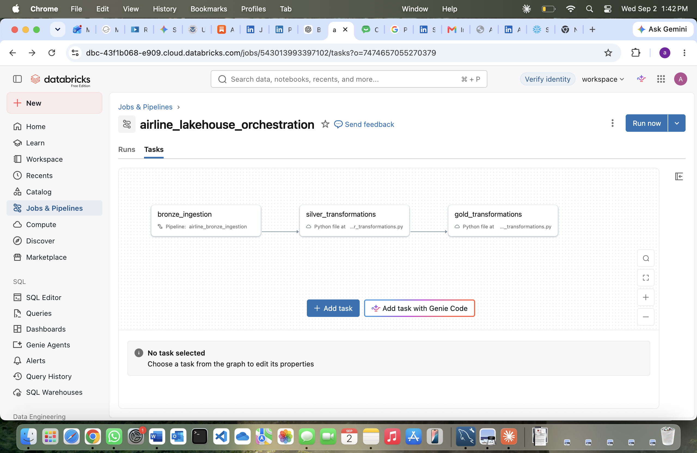
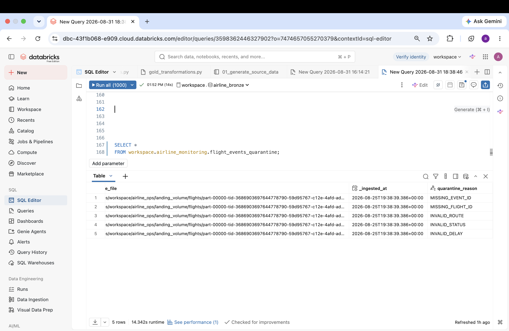
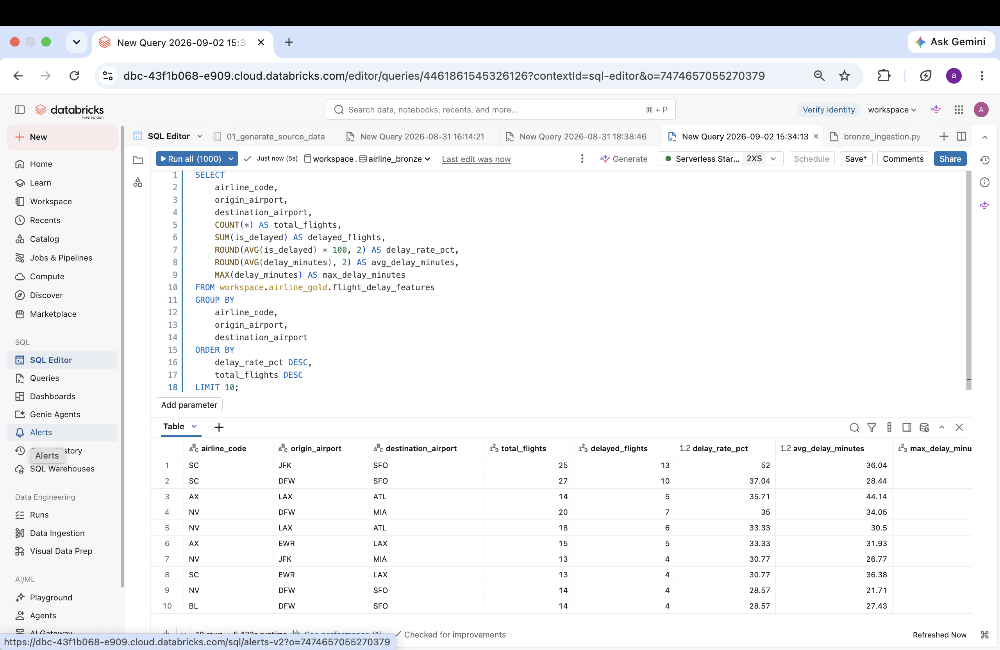
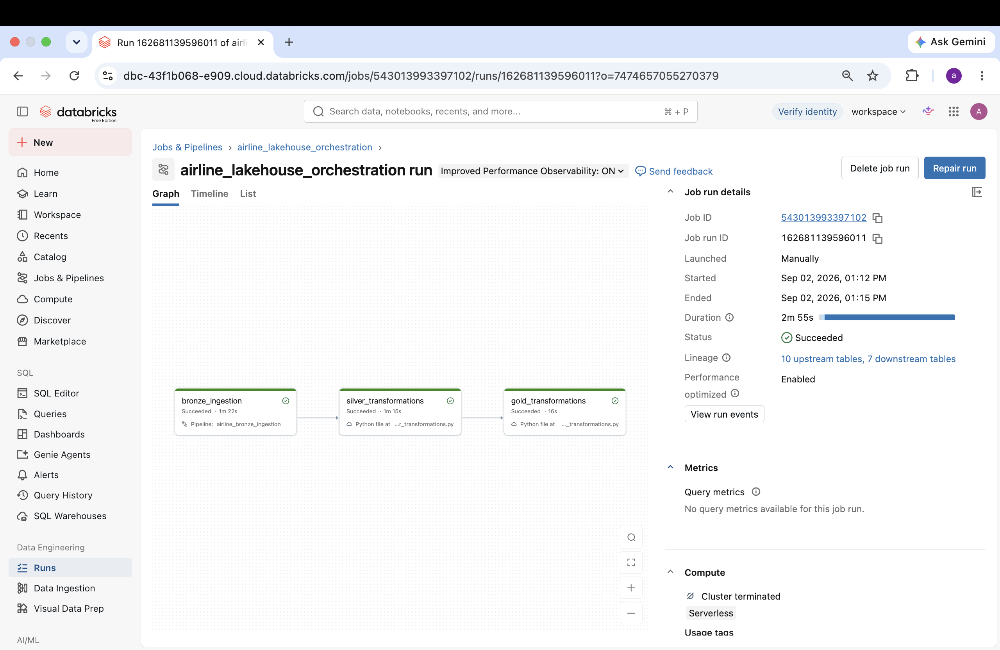
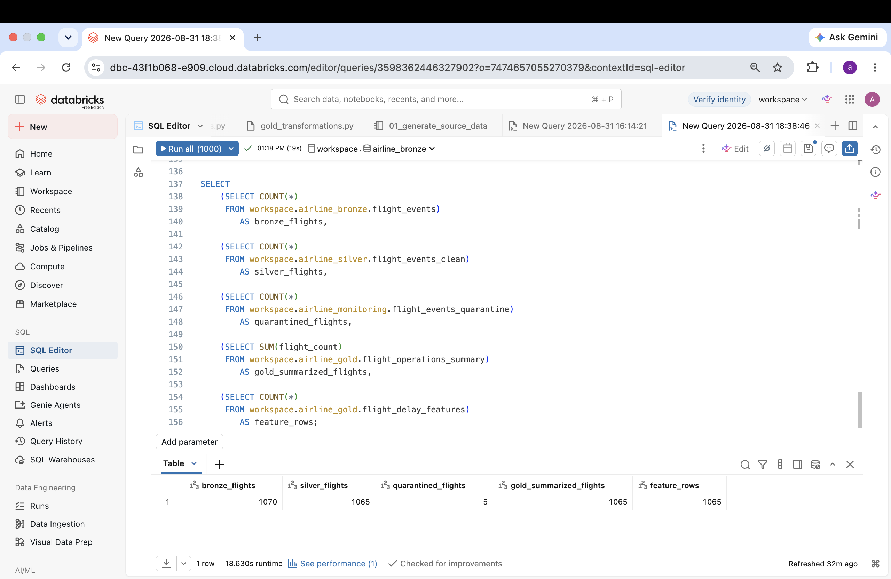

# Real-Time Airline Lakehouse Data Engineering Project

## Live Project Demo

[View Interactive Project Documentation](https://anitha-airline-lakehouse.anitharajbale23.chatgpt.site/#technology)

## Project Overview

This project implements an end-to-end airline data engineering lakehouse on Databricks using a Bronze, Silver, and Gold medallion architecture.

The pipeline ingests raw airline operational data, validates and standardizes records, quarantines invalid events, builds curated Silver datasets, and produces Gold analytics and machine-learning feature tables.

The complete workflow is orchestrated in Databricks as:

`bronze_ingestion → silver_transformations → gold_transformations`

Final reconciliation:

- Bronze flight records: 1,070
- Silver clean flight records: 1,065
- Quarantined flight records: 5
- Gold summarized flights: 1,065
- Gold feature rows: 1,065
- Delayed flights: 199
- On-time flights: 866
- Overall delay rate: 18.69%

The final reconciliation confirms:

`1,070 Bronze records = 1,065 valid records + 5 quarantined records`

All 1,065 valid Silver flight records are represented in both Gold outputs.

---

## Business Problem

Airline operational data arrives from multiple systems including flight operations, airport weather services, aircraft management systems, baggage tracking systems, and reference-data sources.

Raw operational data can contain:

- Missing identifiers
- Invalid routes
- Invalid flight statuses
- Invalid delay values
- Duplicate events
- Inconsistent formatting
- Aircraft master-data changes
- Data from multiple operational domains

The objective of this project is to build a reliable airline lakehouse that transforms these raw data feeds into validated, analytics-ready and machine-learning-ready datasets.

---

## Architecture

The project follows a Databricks medallion architecture:

```text
Raw JSON Files
        |
        v
Databricks Auto Loader
        |
        v
+-------------------+
|   BRONZE LAYER    |
| Raw Delta Tables  |
+-------------------+
        |
        v
+-------------------+
|   SILVER LAYER    |
| Clean / Validated |
| Quarantine / SCD2 |
+-------------------+
        |
        v
+-------------------+
|    GOLD LAYER     |
| Analytics Tables  |
| ML Feature Table  |
+-------------------+
        |
        v
Analytics / ML / Reporting

The complete Databricks Job workflow is:
bronze_ingestion
       |
       v
silver_transformations
       |
       v
gold_transformations
```
Each downstream task runs only after its dependency succeeds.

### Workflow Architecture




## Technology Stack

- Databricks
- Apache Spark
- PySpark
- Spark SQL
- Delta Lake
- Databricks Auto Loader
- Lakeflow / ETL Pipeline
- Databricks Jobs & Workflows
- Unity Catalog
- Python
- SQL
- Medallion Architecture
- Slowly Changing Dimension Type 2
- Data Quality Validation
- Quarantine Processing
- Feature Engineering

---

## Bronze Layer

The Bronze layer performs incremental ingestion of raw airline operational data into Delta Lake.

Databricks Auto Loader is used to ingest source files from Unity Catalog volumes.

### Landing Path

`/Volumes/workspace/airline_ops/landing_volume/`

### Source Domains

- `flights/`
- `weather/`
- `aircraft_cdc/`
- `baggage/`
- `reference/`

### Bronze Tables

The Bronze ingestion pipeline creates the following raw Delta tables:

- `workspace.airline_bronze.flight_events`
- `workspace.airline_bronze.weather_events`
- `workspace.airline_bronze.aircraft_cdc_events`
- `workspace.airline_bronze.baggage_events`
- `workspace.airline_bronze.airports`
- `workspace.airline_bronze.airlines`
- `workspace.airline_bronze.aircraft`
- `workspace.airline_bronze.routes`

### Bronze Flight Volume

Final Bronze flight records: **1,070**

These records are passed to the Silver layer for validation, cleaning, and transformation.

---

## Silver Layer

The Silver layer cleans, validates, deduplicates, and standardizes Bronze data using PySpark.

### Silver Flight Processing

Source table:

`workspace.airline_bronze.flight_events`

Target table:

`workspace.airline_silver.flight_events_clean`

### Transformations

- Standardize identifiers
- Standardize airline and airport codes
- Standardize flight status
- Convert timestamps
- Convert numeric fields
- Validate required fields
- Validate routes
- Validate delay values
- Remove duplicate records

### Flight Data Quality Rules

A valid flight record must satisfy:

- `event_id` is not null
- `flight_id` is not null
- Origin airport is not null
- Destination airport is not null
- Origin and destination are different
- Flight status is valid
- `delay_minutes` is not null
- `delay_minutes >= 0`

### Supported Flight Statuses

- `SCHEDULED`
- `BOARDING`
- `DELAYED`
- `DEPARTED`
- `ARRIVED`
- `CANCELLED`

---

## Quarantine Processing

Records that fail Silver-layer data-quality rules are written to:

`workspace.airline_monitoring.flight_events_quarantine`

### Quarantined Records

The pipeline isolates invalid records instead of dropping them, making data-quality failures traceable and auditable.



### Quarantine Reasons

- `MISSING_EVENT_ID`
- `MISSING_FLIGHT_ID`
- `MISSING_AIRPORT`
- `INVALID_ROUTE`
- `INVALID_STATUS`
- `INVALID_DELAY`
- `UNKNOWN_QUALITY_ERROR`

### Silver Reconciliation

- Bronze flights: **1,070**
- Silver clean flights: **1,065**
- Quarantined flights: **5**

**1,070 = 1,065 valid + 5 quarantined**

This confirms that no Bronze flight records were silently lost during Silver processing.

---

## Weather Processing

Weather observations are cleaned and standardized into:

`workspace.airline_silver.weather_events_clean`

### Weather Validation

Processing includes:

- Weather event ID validation
- Airport code validation
- Weather severity validation
- Visibility validation
- Wind-speed validation
- Timestamp conversion
- Deduplication

Final weather rows: **8**

---

## Baggage Processing

Baggage events are standardized into:

`workspace.airline_silver.baggage_events_clean`

### Baggage Validation

Processing includes:

- Baggage event ID validation
- Bag tag validation
- Flight ID validation
- Airport code validation
- Baggage status validation
- Duplicate event handling

Final baggage rows: **80**

---

## Aircraft CDC and SCD Type 2

Aircraft change events are read from:

`workspace.airline_bronze.aircraft_cdc_events`

and transformed into:

`workspace.airline_silver.aircraft_history`

The aircraft history table preserves historical aircraft changes using Slowly Changing Dimension Type 2 logic.

### Aircraft Results

- Aircraft history rows: **27**
- Current aircraft rows: **24**

---

## Gold Layer

The Gold layer creates analytics-ready and machine-learning-ready datasets from validated Silver data.

### Gold Tables

- `workspace.airline_gold.flight_operations_summary`
- `workspace.airline_gold.flight_delay_features`

---

## Flight Operations Summary

The table:

`workspace.airline_gold.flight_operations_summary`

aggregates airline operational metrics by:

- Flight date
- Airline
- Origin airport
- Destination airport
- Flight status

### Metrics

- Flight count
- Delayed flight count
- On-time flight count
- Average delay
- Maximum delay

### Gold Summary Results

- Summary rows: **996**
- Flights represented: **1,065**

### Route-Level Delay Analytics

The Gold layer supports route-level operational analysis by combining flight counts with delay metrics such as delayed flights, delay rate, average delay, and maximum delay.


---

## Delay Business Rule

A flight is classified as delayed when:

`delay_minutes > 15`

A flight is classified as on time when:

`delay_minutes <= 15`

### Delay Validation Results

- Total flights: **1,065**
- Delayed flights: **199**
- On-time flights: **866**
- Incorrect delay flags: **0**
- Overall delay rate: **18.69%**
---

## Flight Delay Feature Engineering

Feature table:

`workspace.airline_gold.flight_delay_features`

This table contains model-ready features for flight-delay analysis and prediction.

### Flight Features

- Flight ID
- Airline
- Origin airport
- Destination airport
- Aircraft ID
- Flight status

### Time Features

- Scheduled departure
- Departure hour
- Day of week

### Route Features

- Distance
- Scheduled flight duration

### Weather Features

- Temperature
- Wind speed
- Visibility
- Precipitation
- Weather severity

### Target Variable

`is_delayed`

- `1` = delay greater than 15 minutes
- `0` = delay of 15 minutes or less

### Feature Table Results

- Feature rows: **1,065**
- Unique flight IDs: **1,065**
- Null flight IDs: **0**
- Null origin airports: **0**
- Null destination airports: **0**
- Negative delay rows: **0**
- Invalid delay flags: **0**

### Delay Statistics

- Minimum delay: **0 minutes**
- Maximum delay: **164 minutes**
- Average delay: **19.83 minutes**

---

## Databricks Workflow Orchestration

The complete pipeline is orchestrated using Databricks Jobs & Workflows.

### Workflow

`bronze_ingestion → silver_transformations → gold_transformations`

Each downstream task runs only after the previous task succeeds.

### Task 1 — Bronze Ingestion

Type: `ETL Pipeline`

Pipeline:

`airline_bronze_ingestion`

Responsibilities:

- Incremental ingestion with Databricks Auto Loader
- Bronze Delta table creation
- Raw data persistence
- Source metadata capture

### Task 2 — Silver Transformations

Type: `Python Script`

Responsibilities:

- Data cleaning
- Standardization
- Data quality validation
- Quarantine processing
- Deduplication
- Weather transformations
- Baggage transformations
- Aircraft SCD Type 2 processing

Dependency:

`bronze_ingestion`

### Task 3 — Gold Transformations

Type: `Python Script`

Responsibilities:

- Operational aggregation
- Delay metrics
- Route enrichment
- Weather enrichment
- Feature engineering
- Delay target generation

Dependency:

`silver_transformations`

### Workflow Status

The full end-to-end workflow completed successfully:

- `bronze_ingestion` — **Succeeded**
- `silver_transformations` — **Succeeded**
- `gold_transformations` — **Succeeded**

---
### Successful End-to-End Run



## Final End-to-End Validation

The complete pipeline reconciles successfully across Bronze, Silver, and Gold layers.
### Final Reconciliation Image


### Quarantine Validation

| Metric | Result |
|---|---:|
| Bronze flight records | 1,070 |
| Silver clean flights | 1,065 |
| Quarantined flights | 5 |
| Gold summarized flights | 1,065 |
| Gold feature rows | 1,065 |
| Delayed flights | 199 |
| On-time flights | 866 |
| Delay rate | 18.69% |

### Reconciliation Check

**1,070 Bronze records = 1,065 valid records + 5 quarantined records**

All **1,065** valid Silver flight records are represented in both Gold outputs.

No valid records were lost between Silver and Gold.

---

## Key Data Engineering Concepts Demonstrated

- End-to-end Databricks Lakehouse architecture
- Bronze / Silver / Gold medallion design
- Incremental ingestion with Auto Loader
- Delta Lake
- PySpark transformations
- Data quality validation
- Quarantine handling
- Deduplication
- CDC processing
- Slowly Changing Dimension Type 2
- Operational aggregations
- Feature engineering
- ML-ready dataset creation
- Unity Catalog
- Databricks Jobs & Workflows
- Dependency-based orchestration
- Cross-layer reconciliation

---

## Project Outcome

This project delivers a production-style airline data platform that transforms raw operational data into trusted analytics-ready and machine-learning-ready datasets.

The final workflow:

`Bronze → Silver → Gold`

successfully performs ingestion, validation, quarantine handling, historical aircraft tracking, operational aggregation, feature engineering, and end-to-end reconciliation.
